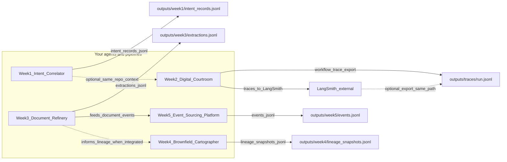

# Data flow diagram — Weeks 1–5 + LangSmith

This document maps **systems** to **artifact paths**, **top-level keys** (as observed in `outputs/` or as specified in `canonical_schema.md`), and whether the interface has **caused a documented schema or integration failure** in this repository (see [DOMAIN_NOTES.md](DOMAIN_NOTES.md) and migration validation).

---

## Diagram (Mermaid)

**Notes on the diagram**

- **Solid arrows** between weeks denote **logical or curriculum data dependencies** (document extraction feeding events; extraction metadata informing lineage). This repo may not implement every wire in code; paths still name the **contract surfaces** you would join.
- **Dashed** arrows are **optional** or **export** paths (LangSmith CLI export to `run.jsonl`; intent context for the same audit run).

---

## One box per system — primary artifact

| System | Primary output path | Top-level keys — **actual** `outputs/` files |
|--------|---------------------|-----------------------------------------------|
| Week 1 Intent Correlator | `outputs/week1/intent_records.jsonl` | `{id, intent_id, mutation_class, tool, tool_use_id, params, contributor, timestamp, vcs, files}` |
| Week 2 Digital Courtroom | `outputs/traces/run.jsonl` (no `outputs/week2/verdicts.jsonl` in repo) | `{inputs, outputs, metadata, langsmith}` |
| Week 3 Document Refinery | `outputs/week3/extractions.jsonl` | `{doc_id, strategy_used, confidence_score, cost_estimate, processing_time, timestamp_utc, escalated_from}` |
| Week 4 Brownfield Cartographer | `outputs/week4/lineage_snapshots.jsonl` | `{directed, multigraph, graph, nodes, edges}` |
| Week 5 Event Sourcing Platform | `outputs/week5/events.jsonl` | `{stream_id, event_type, event_version, payload, recorded_at}` |
| LangSmith (external) | Consumes agent runs; persisted export in this repo is `outputs/traces/run.jsonl` | Same as Week 2 row when file is the export snapshot |

**Canonical schema** (target shapes) for the same logical records are defined in [canonical_schema.md](canonical_schema.md); migrated copies live under `outputs/migrate/`.

---

## Arrow catalog — every listed dependency

For each arrow: **path**, **top-level keys** (of the payload/file named on the arrow), **failure?** = whether this interface has **ever** caused a failure in this project (schema drift, missing file, invalid JSON, or validation miss).

| # | From | To | File path of data transferred | Top-level keys | Failure? |
|---|------|-----|--------------------------------|----------------|----------|
| 1 | Week 1 Intent Correlator | `outputs/week1/intent_records.jsonl` | `outputs/week1/intent_records.jsonl` | `{id, intent_id, mutation_class, tool, tool_use_id, params, contributor, timestamp, vcs, files}` | **Yes** — lines with invalid JSON / concatenated objects; shape ≠ canonical `intent_record` ([DOMAIN_NOTES.md](DOMAIN_NOTES.md)). |
| 2 | Week 2 Digital Courtroom | `outputs/traces/run.jsonl` | `outputs/traces/run.jsonl` | `{inputs, outputs, metadata, langsmith}` | **Yes** — single JSON blob, not `verdict_record` rows; no `outputs/week2/verdicts.jsonl`. |
| 3 | Week 2 Digital Courtroom | LangSmith (cloud) | Runtime trace payload (mirrors export); on disk: `outputs/traces/run.jsonl` | `{inputs, outputs, metadata, langsmith}` | **Yes** — export is not canonical LangSmith `trace_record` JSONL per [canonical_schema.md](canonical_schema.md). |
| 4 | LangSmith (export / re-import) | `outputs/traces/run.jsonl` | `outputs/traces/run.jsonl` | `{inputs, outputs, metadata, langsmith}` | **Yes** — same as row 2 when treated as `trace_record`. |
| 5 | Week 3 Document Refinery | `outputs/week3/extractions.jsonl` | `outputs/week3/extractions.jsonl` | `{doc_id, strategy_used, confidence_score, cost_estimate, processing_time, timestamp_utc, escalated_from}` | **Yes** — flat metrics vs canonical nested `extraction_record` ([DOMAIN_NOTES.md](DOMAIN_NOTES.md)). |
| 6 | Week 4 Brownfield Cartographer | `outputs/week4/lineage_snapshots.jsonl` | `outputs/week4/lineage_snapshots.jsonl` | `{directed, multigraph, graph, nodes, edges}` | **Yes** — NetworkX-style graph ≠ canonical `lineage_snapshot` envelope ([DOMAIN_NOTES.md](DOMAIN_NOTES.md)). |
| 7 | Week 5 Event Sourcing Platform | `outputs/week5/events.jsonl` | `outputs/week5/events.jsonl` | `{stream_id, event_type, event_version, payload, recorded_at}` | **Yes** — missing canonical `event_id`, `aggregate_id`, `sequence_number`, `metadata`, `occurred_at`, `schema_version` ([DOMAIN_NOTES.md](DOMAIN_NOTES.md)). |
| 8 | Week 3 Document Refinery | Week 5 Event Sourcing Platform | Upstream: `outputs/week3/extractions.jsonl` → Downstream: `outputs/week5/events.jsonl` | Source: `{doc_id, strategy_used, confidence_score, cost_estimate, processing_time, timestamp_utc, escalated_from}` · Target: `{stream_id, event_type, event_version, payload, recorded_at}` | **Yes** — no shared contract enforced between extraction rows and event rows in this repo; cross-stream IDs not aligned by schema. |
| 9 | Week 3 Document Refinery | Week 4 Brownfield Cartographer | Upstream: `outputs/week3/extractions.jsonl` → Downstream: `outputs/week4/lineage_snapshots.jsonl` | Source keys as row 5 · Target keys as row 6 | **Yes** — lineage file in repo does not reference extraction schema; integration not validated. |
| 10 | Week 1 Intent Correlator | Week 2 Digital Courtroom | Contextual: `outputs/week1/intent_records.jsonl` vs audit subject in `outputs/traces/run.jsonl` | W1 keys as row 1 · W2 keys as row 2 | **Yes** — no single shared schema between intent traces and courtroom export; both deviate from canonical. |

**Failure = Yes** here means: at least one **observed** mismatch, parse issue, or missing canonical field has been documented for that path or cross-system join—not necessarily a production outage.

---

## Canonical top-level keys (target contracts)

For comparison when enforcing [Open Data Contract Standard](https://github.com/bitol-io/open-data-contract-standard/blob/main/docs/references.md)-style contracts:

| Record | Canonical top-level keys |
|--------|----------------------------|
| `intent_record` | `intent_id`, `description`, `code_refs`, `governance_tags`, `created_at` |
| `verdict_record` | `verdict_id`, `target_ref`, `rubric_id`, `rubric_version`, `scores`, `overall_verdict`, `overall_score`, `confidence`, `evaluated_at` |
| `extraction_record` | `doc_id`, `source_path`, `source_hash`, `extracted_facts`, `entities`, `extraction_model`, `processing_time_ms`, `token_count`, `extracted_at` |
| `lineage_snapshot` | `snapshot_id`, `codebase_root`, `git_commit`, `nodes`, `edges`, `captured_at` |
| `event_record` | `event_id`, `event_type`, `aggregate_id`, `aggregate_type`, `sequence_number`, `payload`, `metadata`, `schema_version`, `occurred_at`, `recorded_at` |
| `trace_record` | `id`, `name`, `run_type`, `inputs`, `outputs`, `error`, `start_time`, `end_time`, `total_tokens`, `prompt_tokens`, `completion_tokens`, `total_cost`, `tags`, `parent_run_id`, `session_id` |

Migrated artifacts under `outputs/migrate/` align on these keys; raw `outputs/` files align on **actual** keys in the tables above.
