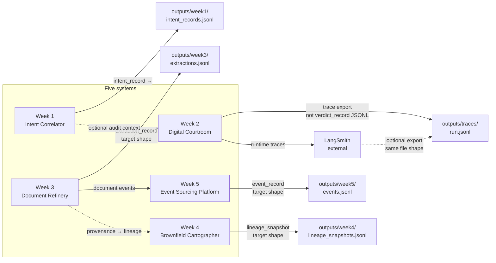
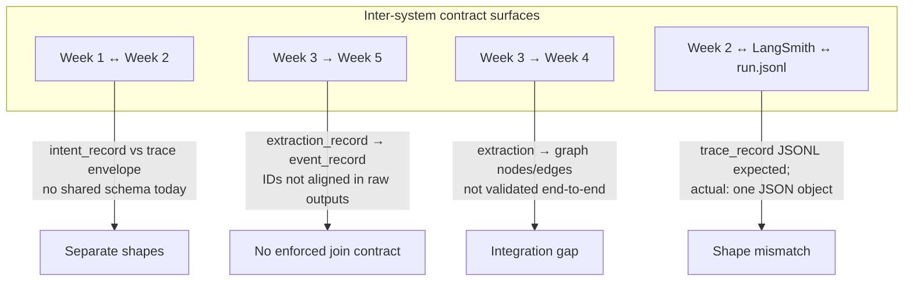

# Thursday Interim Report — Data Contract Enforcer

**Course:** FDE Training · **Repository:** `data-contract-enforcer`  
**Public PDF (Google Drive, view link for graders):** *Add your shareable link here when you export this document to PDF.*

This report satisfies the Thursday deliverable: **data flow diagram**, **contract coverage table**, **first validation run summary**, and **reflection**. Evidence for schema deviations is drawn from **`DOMAIN_NOTES.md`** (outputs vs `canonical_schema.md`).

---

## 1. Data Flow Diagram

The platform is modeled as **five systems** that each emit a primary persisted artifact, plus **LangSmith** as an external observability path. Arrows are annotated with the **canonical record type or named artifact** each boundary is meant to carry, consistent with `DOMAIN_NOTES.md` and `data_flow_diagran.md`.

### Figure 1 — Systems, files, and schema names on each wire



### Figure 2 — Cross-system and observability boundaries (record types)



Together, the figures show **where data changes shape**: at each file write, at LangSmith export, and at logical joins between weeks. That is where **data contracts** must attach so graders (and operators) can infer enforcement points without opening the codebase.

---

## 2. Contract Coverage Table

The table lists **inter-system and file-boundary interfaces** from the architecture above. Status is **Yes** (contract file covers the intended surface), **Partial** (contract exists but scope or validation is incomplete), or **No** (no contract). Rationale for **Partial** and **No** references concrete gaps from **`DOMAIN_NOTES.md`**.

| Interface (producer → artifact / consumer) | Contract? | Rationale |
|-------------------------------------------|-----------|-----------|
| Week 1 → `outputs/week1/intent_records.jsonl` (`intent_record`) | **No** | Actual rows use `id`, string `intent_id`, `mutation_class`, `tool`, `files[]`; canonical expects uuid `intent_id`, `description`, `code_refs[]`, `governance_tags[]`, `created_at`. **Line 2 concatenates two JSON objects without a newline** (invalid JSONL for that line). Two `code_refs` shape variants in one file. |
| Week 2 → `outputs/week2/verdicts.jsonl` (`verdict_record`) | **No** | **File missing** in `outputs/`. Trace lives in `outputs/traces/run.jsonl` as **one** JSON object with `inputs`, `outputs`, `metadata`, `langsmith` — not JSONL verdict rows. |
| Week 2 ↔ LangSmith → `outputs/traces/run.jsonl` (`trace_record`) | **No** | Canonical expects JSONL `trace_record` rows with `id`, `name`, `run_type`, token fields, costs, `tags`, etc. **Actual:** single workflow JSON (~1110 lines), not a per-run JSONL stream (`DOMAIN_NOTES.md` Part A). |
| Week 3 → `outputs/week3/extractions.jsonl` → migrated `outputs/migrate/week3/extractions.jsonl` (`extraction_record`) | **Partial** | **`generated_contracts/week3-document-refinery-extractions.yaml`** targets the **flattened, exploded-fact** frame used with `ContractGenerator` / `ValidationRunner` on migrated data. Raw Week 3 rows are **flat** (`strategy_used`, `confidence_score`, `timestamp_utc`) vs canonical nested `extracted_facts[]`, `entities[]`, `extracted_at` — so coverage is **partial** until raw and canonical paths converge. |
| Week 4 → `outputs/week4/lineage_snapshots*.jsonl` (`lineage_snapshot`) | **No** | **NetworkX-style** graph (`directed`, `multigraph`, `graph`, `nodes`, `edges`, `edge_type`) vs canonical envelope with `snapshot_id`, `codebase_root`, `git_commit`, edges with `relationship` in {IMPORTS, CALLS, …}. |
| Week 5 → `outputs/week5/events.jsonl` (`event_record`) | **No** | Rows have `stream_id`, `event_type`, `event_version`, `payload`, `recorded_at` only — missing `event_id`, `aggregate_id`, `aggregate_type`, `sequence_number`, `metadata`, `schema_version`, `occurred_at` (`DOMAIN_NOTES.md`). |
| Week 3 → Week 5 (extractions → events) | **No** | No shared contract enforcing IDs or payload linkage between extraction rows and event rows in this repo. |
| Week 3 → Week 4 (extractions → lineage) | **No** | Lineage artifact does not reference extraction schema; cross-system integration not validated. |
| Week 1 ↔ Week 2 (intent vs courtroom trace) | **No** | No unified contract; both sides deviate from canonical in different ways. |

**Coverage risk:** Only the **Week 3 migrated / flattened extraction** path has a generated YAML contract and automated validation in-repo today; other boundaries rely on documentation and manual review until normalized.

---

## 3. First Validation Run Results

**Run:** `ValidationRunner` on **own migrated data** and the Week 3 generated contract (first run with **no** `schema_snapshots/baselines.json`, so statistical drift was not evaluated yet).

```bash
python contracts/runner.py \
  --source outputs/migrate/week3/extractions.jsonl \
  --contract generated_contracts/week3-document-refinery-extractions.yaml \
  --report reports/validation_report_first.json
```

**Results (`reports/validation_report_first.json`):**

| Item | Value |
|------|--------|
| Overall | **PASS** |
| Structural findings | **0** — no CRITICAL issues (required fields, numeric types, enums, UUID and date-time formats all satisfied for columns present) |
| Statistical findings | **0** — range checks passed where applicable; **drift** not run (baselines file absent before this run) |
| Errors | **0** |
| Baselines | **Created:** `schema_snapshots/baselines.json` (per-column mean and stddev for numeric columns, for subsequent drift checks) |

**Violations:** None on this run for the migrated extraction file under the current contract.

**Meaning:** Validation is acting as a **risk detector**, not a rubber stamp. A **PASS** here means the **profiled migrated + exploded** frame matches the contract clauses today. It does **not** certify raw Week 3 `outputs/week3/extractions.jsonl` or the other weeks — those gaps remain as in **Section 2**. After baselines exist, a material shift in numeric means (e.g. confidence scale drift) can surface as WARN/FAIL on the next run.

---

## 4. Reflection

Formalizing contracts pushed me to see the platform as **boundaries and record types**, not as one undifferentiated pipeline. I had assumed each week’s `outputs/*.jsonl` was close to `canonical_schema.md`, but **`DOMAIN_NOTES.md`** made the gaps explicit: Week 3 outputs are **flat** run metrics while the canonical **`extraction_record`** expects nested **`extracted_facts[]`** and different timestamps; Week 4 persists a **NetworkX** graph, not the canonical **`lineage_snapshot`** envelope with `snapshot_id` and relationship enums; Week 5 events omit **`aggregate_id`**, **`sequence_number`**, and **`occurred_at`**, so ordering rules in the canonical design cannot even be stated against current files.

A concrete wrong assumption was that **LangSmith export** would be JSONL **`trace_record`** rows. Instead, **`outputs/traces/run.jsonl`** is a **single large JSON object** — which breaks the mental model of “one record per line” until we normalize or split the export. That directly explains why the Week 2 / trace interface is still **No** in the coverage table: the artifact shape does not match the record type we intended to version.

Contract work also elevated **data quality** issues I had minimized, such as **Week 1** lines that are not valid JSONL. Those are not cosmetic; any strict boundary validator will fail them, which is preferable to silent corruption downstream.

The first **ValidationRunner** **PASS** on migrated Week 3 data is useful evidence that the **exploded fact** contract matches data **for that path**, while underscoring that **Partial** coverage is an honest status until raw sources and other weeks are brought under the same discipline. Next I will extend generate → validate to **events** or **lineage** once shapes are migrated enough to profile meaningfully.

---

*End of report.*
